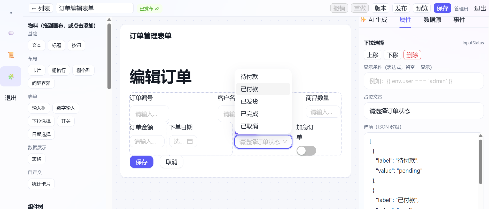
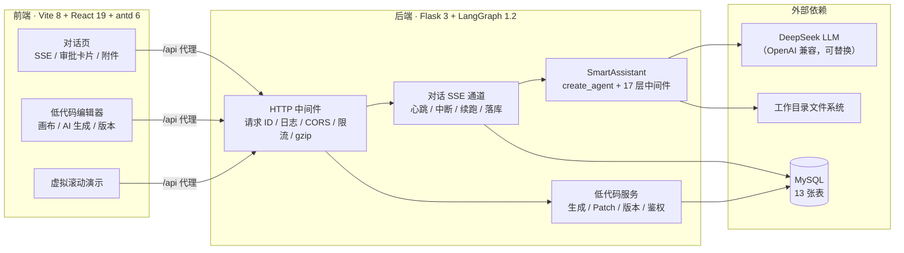
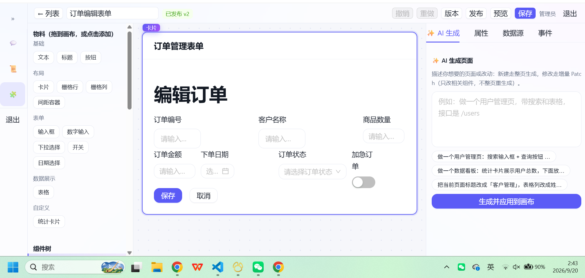

# AI-Agent

基于 **LangChain 1.x / LangGraph** 的全栈 AI Agent 演示项目：智能对话 + 人工介入审批 + 代码读写 + AI 低代码平台。

支持对话 / 附件上传识图 / 人工介入审批 / 任务规划 / 代码读写 / 长期短期记忆 / AI 低代码


## ✨ 功能特性

| 模块 | 说明 |
| --- | --- |
| 💬 智能对话 | SSE 逐 token 流式输出，15s 心跳保活；多会话服务端持久化、自动起标题、停止与断线续跑 |
| 📎 附件识图 | 31 种扩展名（PDF / Word / Excel / 图片 / 代码…）；图片压缩后多模态识图，表格转 Markdown 注入 |
| 🛡️ 人工审批 | 8 个写操作工具执行前挂起，前端弹出审批卡片（批准 / 修改参数 / 拒绝），确认后才真正执行 |
| 🧩 任务规划 | 内置 `write_todos` 工具：复杂任务先拆步骤，前端 Todo 面板实时同步进度 |
| 📂 代码读写 | 在用户选定的工作目录内：列目录 / 读文件 / 搜代码 / 写文件 / 精确替换 / 删除文件 |
| 🧠 记忆系统 | 短期：超阈值自动摘要 + 旧工具结果清理；长期：用户信息写入 Agent Store 跨会话保留 |
| ⚙️ 中间件栈 | 17 层生产级中间件：可观测 / 输入护栏 / PII 脱敏 / 预算限额 / 模型降级重试 / 工具重试兜底 |
| 🏗️ AI 低代码 | 一句话生成页面 Schema、增量 Patch 修改、版本发布回滚对比、登录与权限、免发布预览 |
| 📜 虚拟滚动 | 1 万行数据只渲染 14 行：ResizeObserver 量真实行高 + 前缀和定位 |

### 🏗️ AI 低代码平台

- **自然语言 → 页面 Schema**：SSE 流式生成，模型自校验失败自动回炉重试（最多 3 轮）；
- **增量修改**：语义化 Patch（`update_props` / `add_node` / `set_event` / `upsert_data_source`…），只动相关节点，不整页重生成；
- **可视化编辑器**：拖拽画布 / 组件树 / 属性面板 / 数据源 / 事件绑定；受限表达式引擎（`{{ }}` 模板，无 `eval` 的安全解释器）；
- **版本管理**：发布快照、一键回滚、版本 diff 对比；
- **权限体系**：token 登录（PBKDF2 哈希），admin / editor / viewer 三级权限，`baseVersion` 乐观锁防互相覆盖。

用户输入提示词 → 生成 schema 结构 → 画布动态渲染：



## 🏗️ 系统架构



一轮对话的链路：前端发消息 → 后端落库并从库重建上下文 → Agent（中间件栈 → 模型 → 工具）→ SSE 逐 token 推回前端；命中审批工具时挂起中断，用户确认后 `resume` 续跑。

## 🧱 技术栈

| 层 | 技术 |
| --- | --- |
| 前端 | Vite 8 · React 19（React Compiler） · antd 6 · react-router 8 · TypeScript |
| 后端 | Flask 3 · LangChain 1.4 · LangGraph 1.2 · PyMySQL |
| 模型 | DeepSeek（`deepseek-flash` 主备降级），可替换任意 OpenAI 兼容服务 |
| 数据库 | MySQL（会话 / 附件 / 工具数据 / 低代码，共 13 张表） |
| 文档解析 | pypdf · python-docx · openpyxl · Pillow |

## 📂 目录结构

```
ai-agent/
├─ backend/                    # Flask + LangGraph 后端（Python 3.13）
│  ├─ app.py                   # 入口：注册蓝图 + HTTP 中间件 + 建表
│  ├─ config.py                # 全部配置集中读取（.env），含中间件开关
│  ├─ http_middleware.py       # 请求 ID / 访问日志 / CORS / 限流 / gzip / 健康检查
│  ├─ message.py               # 对话 SSE 通道：心跳 / 中断 / 续跑 / 落库
│  ├─ conversation_api.py      # 会话与消息 REST 接口
│  ├─ db.py                    # MySQL 访问层（建表 / 会话 / 消息）
│  ├─ attachment/              # 附件上传、解析（PDF/Word/Excel/图片）、入库
│  ├─ AIagent/                 # Agent 核心
│  │  ├─ assistant.py          # SmartAssistant：模型 + 工具 + 17 层中间件栈
│  │  ├─ tools.py              # 业务工具（天气 / 计算 / 时间 / 汇率 / 搜索）
│  │  ├─ file_tools.py         # 代码读写工具（列 / 读 / 搜 / 写 / 改 / 删）
│  │  ├─ approval.py           # 审批工具清单与动作提取
│  │  └─ middleware.py         # 自研中间件（可观测 / 输入护栏 / PII 脱敏）
│  ├─ lowcode_*.py             # 低代码平台：schema 校验 / Patch / 存储 / 接口 / AI 生成 / 鉴权
│  ├─ tool_store.py            # 工具业务数据访问（MySQL）
│  └─ test_lowcode_*.py        # 冒烟测试（30 项断言 + 真实模型两轮验证）
├─ frontend/                   # Vite + React 19 + antd 6
│  └─ src/
│     ├─ api/                  # 接口客户端（http.ts 统一请求；chat.ts SSE 流）
│     ├─ hooks/                # useChat / useConversations / useAttachments / useWorkspace
│     ├─ components/           # 对话 UI：消息列表 / 输入框 / 审批卡片 / Todo 面板…
│     ├─ lowcode/              # 低代码平台
│     │  ├─ schema/            # 命令层（唯一写入口）+ 类型 + patch + diff
│     │  ├─ runtime/           # 表达式引擎 / RuntimeStore / Renderer
│     │  ├─ materials/         # 物料注册表（组件 + 元数据，属性面板自动生成表单）
│     │  └─ editor/            # 编辑器：画布 / 物料 / 属性 / 数据源 / 事件 / AI 面板 / 版本
│     └─ pages/                # 虚拟滚动演示页
├─ image.png                   # 低代码平台截图
└─ README.md
```

## 🚀 快速开始

### 1. 环境要求

- Python 3.10+（开发使用 3.13）
- Node.js 20+ 与 pnpm
- MySQL 5.7+ / 8.x

### 2. 启动后端

```bash
cd backend
python -m venv .venv
.venv\Scripts\activate          # Windows；macOS/Linux 用 source .venv/bin/activate
pip install -r requirements.txt
copy .env.example .env          # Windows；macOS/Linux 用 cp，然后填入密钥与数据库信息
python app.py                   # http://127.0.0.1:5000
```

> 后端模块使用裸导入（`import db`、`from AIagent.tools import ...`），必须在 `backend/` 目录下启动。

### 3. 启动前端

```bash
cd frontend
pnpm install
pnpm dev                        # http://localhost:5173
```

开发服务器会把 `/api` 代理到 `http://127.0.0.1:5000`（见 `frontend/vite.config.ts`）。

### 4. 低代码平台演示账号

| 账号 | 密码 | 角色 |
| --- | --- | --- |
| `admin` | `admin123` | 管理员（全能） |
| `alice` | `alice123` | 编辑者（只能改自己的页面） |
| `bob` | `bob123` | 只读 |

## 🔧 配置说明

所有环境变量集中在 `backend/config.py` 读取，完整清单见 `backend/.env.example`：

- **模型**：`DEEPSEEK_API_KEY` / `DEEPSEEK_API_BASE` / `AGENT_MODEL`，主模型重试仍失败时自动降级到 `FALLBACK_MODEL`；
- **数据库**：`DB_HOST` / `DB_PORT` / `DB_USER` / `DB_PASSWORD` / `DB_NAME`，表在服务启动时自动创建（老库自动补列）；
- **中间件开关与阈值**：`AGENT_*` 系列 —— demo 刻意取小值（如摘要阈值 1500 token），聊几轮就能看到摘要、上下文清理、限额保护生效；
- **限流 / CORS / gzip**：`RATE_LIMIT_*`、`CORS_*`、`GZIP_*`；SSE 长连接不会被 gzip 压缩。

## 📸 界面截图

### 对话 + 工具调用


### 人工介入审批

写文件类工具执行前会挂起，用户在卡片上批准 / 修改参数 / 拒绝，确认后才真正落盘：


### 选择工作目录进行代码修改


### AI 低代码平台





